# Cricket Analysis and Prediction using ML.Net(C#)


<span style="color:red"><b>Disclaimer:</b> The analysis and prediction done here is for learning purpose only and should not be used for any illegal activities such as betting.</span>

## Introduction

Cricket, a game of bat and ball is one of the most popular games and played in varied formats. It's a game of numbers with each match generating a plethora of data about players and matches. This data is used by analysts and data scientists to uncover meaningful insights and forecast about matches and players performance. In this session, I'll be performing some analytics and prediction on the cricket data using Microsoft ML.Net framework and C#. 

### History

- Invented in 1550, originated by England
- First International match was played between Canada and USA in New York
- First One Day International(ODI) was played in 1971
- First Cricket World Cup was played in 1975
- First T20 Match was played in 2003

### Match Formats

- One Day International(ODI) : 50 Over
- Test Match : 5 days
- T20 : 20 Overs
- Indian Premier League : 20 Overs

### IPL Statistics (2019-2020)

- Participating Nations:  104
- Valuation : $6.7 billion
- Viewers : 370 Million

If we look at the above stats, it clearly depicts the popularity and money involved in Cricket. 

## Problem Statement

Analyze the cricket dataset and predict the score after 6 overs for a match.

### Solution Overview

As we need to predict the continuous value, its a regression problem in the space of Machine Learning. We'll be using .Net DataFrame for Exploratory Data Analysis(EDA) and ML.Net for predicting the score after 6 overs.

#### Platform/Tool

I have used .Net interactive tool on a Jupyter Notebook to create a *.ipynb file with C# as a kernel. 

##### Prerequisites

- [Jupyter Notebook](https://jupyter.org/install)
- [dotnet interactive](https://devblogs.microsoft.com/dotnet/net-interactive-is-here-net-notebooks-preview-2/)

#### Dataset

Source: [CricSheet](https://cricsheet.org/) > [Download T20 Dataset](https://cricsheet.org/downloads/t20s_male_csv2.zip)

### Exploratory Data Analysis - EDA

Summary of data analysis

- No of Features: 22
- Total Records: 194K
- Features have a mix of date, number and string
- Contains Null Values

We'll be executing command on a .Net interactive Jupyter notebook. 

Lets get started

Open a command prompt or powershell and execute 'Jupyter notebook'. A new window opens in default browser. 

Click New and select .Net(C#) as kernel to create a new notebook

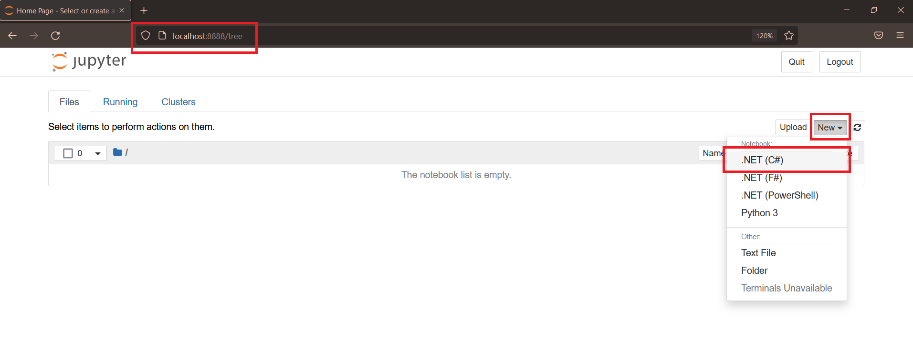

A new notebook will be created. Give a name by clicking on Untitled and execute  ```#!about``` command in the cell to verify installation of .net interactive.

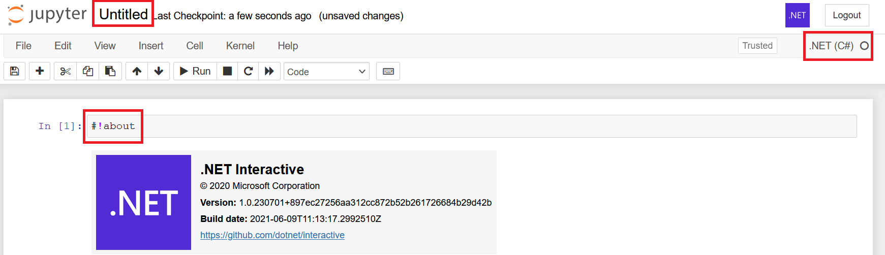


### 1. Define Application wide Items

#### Install Nuget Packages

```c#
// ML.NET Nuget packages installation
#r "nuget:Microsoft.ML"
#r "nuget:Microsoft.ML.FastTree"    
#r "nuget:Microsoft.Data.Analysis"
#r "nuget:Daany.DataFrame, 1.0.0"
#r "nuget:CsvHelper"
```

#### Import Namespaces

```c#
using CsvHelper;
using CsvHelper.Configuration;
using Daany;
using Microsoft.ML;
using Microsoft.ML.Data;
using Microsoft.Data.Analysis;
using Microsoft.AspNetCore.Html;
using Microsoft.DotNet.Interactive.Formatting;
using static Microsoft.DotNet.Interactive.Formatting.PocketViewTags;
using System.Net.Http;
using System.IO;
using System.IO.Compression;
using System.Globalization;
```

#### Define Constants

```c#
// File
const string DATASET_DIRECTORY = "t20s_male_csv2";
const string DATASET_FILE = "t20s_male_csv2.zip";
const string DATASET_URL = "https://cricsheet.org/downloads/";
const string DATASET_MERGED_CSV = "t20_merged.csv";
const string DATASET_ALL_CSV = "t20_all.csv";
const string DATASET_CLEANED_CSV = "t20_cleaned.csv";
const string MODEL_FILE = "model.zip";
const string SEARCH_PATTERN = "*.csv";

// DataFrame/Table
const int TOP_COUNT = 5;
const int DEFAULT_ROW_COUNT = 10;

// Columns
const string CSV_COLUMN_BALL = "ball";
const string CSV_COLUMN_SCORE = "score";
const string CSV_COLUMN_RUNS_OFF_BAT = "runs_off_bat";
const string CSV_COLUMN_EXTRAS = "extras";
const string CSV_COLUMN_TOTAL_SCORE = "total_score";
const string CSV_COLUMN_VENUE = "venue";
const string CSV_COLUMN_INNINGS = "innings";
const string CSV_COLUMN_BATTING_TEAM = "batting_team";
const string CSV_COLUMN_BOWLING_TEAM = "bowling_team";
const string CSV_COLUMN_STRIKER = "striker";
const string CSV_COLUMN_NON_STRIKER = "non_striker";
const string CSV_COLUMN_BOWLER = "bowler";

// Misc
const float OVER_THRESHOLD = 6.0f;
```

### 2. Utility Functions

#### Merges multiple CSV files present in specified directory

The dataset downloaded from cricksheet.org is a zip of multiple files pertaining to a match. In order to use it for analysis, we need to merge all the files into a single file. The below method helps merge these files

```c#
/// <summary>
/// Merges files present in a directory into a single file
/// </summary>
/// <param name="sourceFolder">Directory containing files to be merged</param>
/// <param name="destinationFile">Output single file</param>
/// <param name="searchPattern">Pattern to be searched for files within a directory such as *.csv</param>
/// <param name="excludeFiles">A predicate to exclude files</param>
public void MergeCsv(string sourceFolder, string destinationFile, string searchPattern, Predicate<string> excludeFiles)
{
    /*
     https://chris.koester.io/index.php/2017/01/27/combine-csv-files/
     C# script combines multiple csv files without duplicating headers.
     Combining 8 files with a combined total of about 9.2 million rows 
     took about 3.5 minutes on a network share and 44 seconds on an SSD.
    */

    // Specify wildcard search to match CSV files that will be combined
    string[] filePaths = Array.FindAll(Directory.GetFiles(sourceFolder, searchPattern, SearchOption.AllDirectories), excludeFiles);
    StreamWriter fileDest = new StreamWriter(destinationFile, true);

    int i;
    for (i = 0; i < filePaths.Length; i++)
    {
        string file = filePaths[i];
        string[] lines = File.ReadAllLines(file);
        if (i > 0)
        {
            lines = lines.Skip(1).ToArray(); // Skip header row for all but first file
        }
        foreach (string line in lines)
        {
            fileDest.WriteLine(line);
        }
    }
    fileDest.Close();
}
```

The extracted files contains files ending with 'info' which has different set of columns and we need to ignore them while merging. In order to achieve that a helper method is introduced.

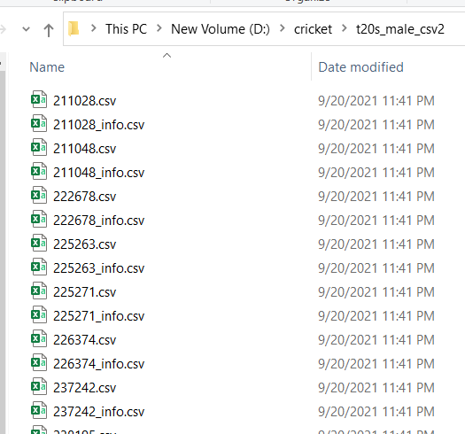 

```c#
/// <summary>
/// Exclude files based on a condition
/// </summary>
/// <param name="fileName">Name of the file</param>
/// <returns>True, if matched else false</returns>
public bool ExcludeFiles(string fileName)
{
    if (fileName.EndsWith("info.csv"))
    {
        return false;
    }
    return true;
}
```

#### Formatters

By default the output of DataFrame is not proper and in order to display it as a table, we need to have a custom formatter implemented as shown in next cell. 

```c#
// Formats the table
Formatter.Register(typeof(Microsoft.Data.Analysis.DataFrame),(dataFrame, writer) =>
{
    var df = dataFrame as Microsoft.Data.Analysis.DataFrame;
    var headers = new List<IHtmlContent>();
    headers.Add(th(i("index")));
    headers.AddRange(df.Columns.Select(c => (IHtmlContent)th(c.Name)));
    var rows = new List<List<IHtmlContent>>();
    var take = 10;
    for (var i = 0; i < Math.Min(take, df.Rows.Count); i++)
    {
        var cells = new List<IHtmlContent>();
        cells.Add(td(i));
        foreach (var obj in df.Rows[i])
        {
            cells.Add(td(obj));
        }
        rows.Add(cells);
    }

    var t = table(
        thead(
            headers),
        tbody(
            rows.Select(
                r => tr(r))));

    writer.Write(t);
}, "text/html");
```

### 3. Load Dataset

The Dataset present in Cricksheet.org is in compressed zip format. Internally it contains csv file that we will be using for our analysis and prediction.

#### 3.a Cleans Previous Data

The below method cleans any previous data on the system

```c#
/// <summary>
/// Cleans previous data present in current working directory
/// </summary>
public void CleanPreviousData()
{
    if (File.Exists(DATASET_FILE))
    {
        File.Delete(DATASET_FILE);
    }

    if (File.Exists(DATASET_MERGED_CSV))
    {
        File.Delete(DATASET_MERGED_CSV);
    }
    
    if (File.Exists(DATASET_CLEANED_CSV))
    {
        File.Delete(DATASET_CLEANED_CSV);
    }
    
    if (Directory.Exists(DATASET_DIRECTORY))
    {
        Directory.Delete(DATASET_DIRECTORY, true);
    }
}
```

#### 3.b Loads the Dataset and returns a DataFrame

```c#
/// <summary>
/// Loads the dataset from specified URL
/// </summary>
/// <param name="url">Remote URL</param>
/// <param name="fileName">Name of the file</param>
/// <returns>A DataFrame</returns>
public async Task<Microsoft.Data.Analysis.DataFrame> LoadDatasetAsync(string url, string fileName)
{
    // Delete previous data
    CleanPreviousData();

    // Loads zip file from remote URL
    var remoteFilePath = Path.Combine(url, fileName);
    using (var httpClient = new HttpClient())
    {
        var contents = await httpClient.GetByteArrayAsync(remoteFilePath);
        await File.WriteAllBytesAsync(fileName, contents);
    }

    // Unzip file -> Merge CSV -> Load to DataFrame
    if (File.Exists(fileName))
    {
        var extractedDirectory = Path.Combine(Directory.GetCurrentDirectory(), DATASET_DIRECTORY);

        try
        {
            ZipFile.ExtractToDirectory(fileName, extractedDirectory);
            MergeCsv(extractedDirectory, DATASET_MERGED_CSV, SEARCH_PATTERN, ExcludeFiles);

            return Microsoft.Data.Analysis.DataFrame.LoadCsv(DATASET_MERGED_CSV);
        }
        catch (Exception e)
        {
            display(e);
            throw;
        }

    }

    return new Microsoft.Data.Analysis.DataFrame();
}
```

Now, we'll load the DataFrame from files.

```c#
// Load Dataset
var cricketDataFrame = await LoadDatasetAsync(DATASET_URL, DATASET_FILE);
```

A preview of this dataframe looks as below

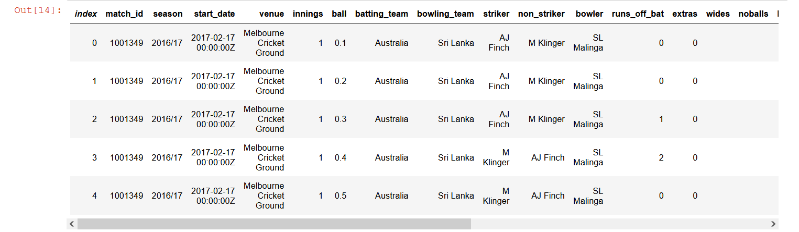

#### 3.c Filtering

As we are considering data for initial 6 overs of a match, we need to remove data for further overs.

```c#
// Filter dataset to six overs
var filterColumn = cricketDataFrame.Columns[CSV_COLUMN_BALL].ElementwiseLessThanOrEqual(OVER_THRESHOLD);
var sixOverDataFrame = cricketDataFrame.Filter(filterColumn);
```

### 4. Data Analysis

We will analyze the filtered dataframe by executing different commands

#### 4.a Top records

```c#
sixOverDataFrame.Head(TOP_COUNT)
```

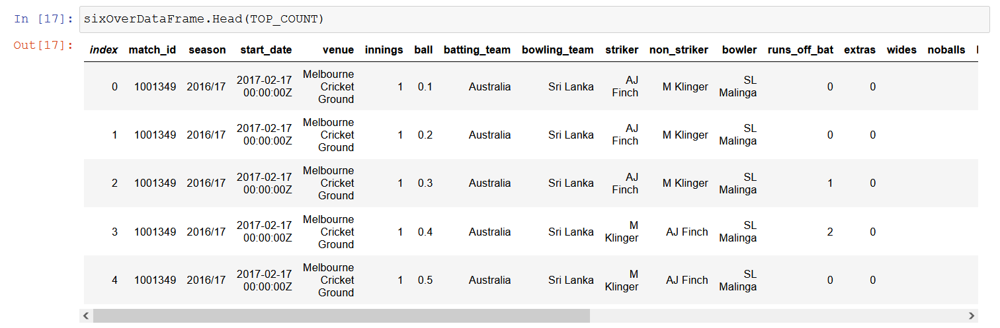

#### 4.b Information about the dataset

```c#
// Information about the dataset
sixOverDataFrame.Info()
```

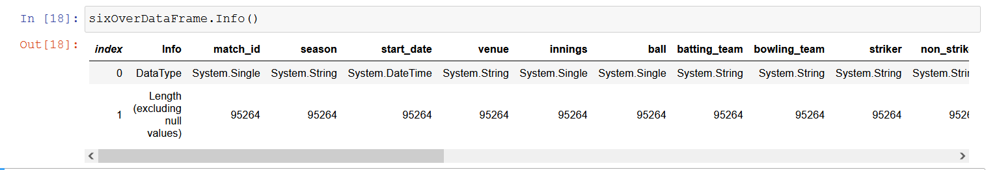

We can see there are around 95264 records present in our dataset of six overs. First row represents the datatype of each column.

#### 4.c Description about the Dataset

```c#
// Description about the dataset
sixOverDataFrame.Description()
```

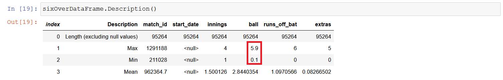

Min value of 0.1 and Max value of 5.9 confirms the dataset is for 6 overs only.

#### 4.d Score and Total Score

The dataset contains various runs scored every ball such as runs_off_bat, extras, wides, legbyes etc. There is no column for runs scored per ball. We could get it by adding 'runs_off_bat' and 'extras'.

**Score = runs_off_bat + extras**

Similary we can get total runs per ball by having a cumulative sum of runs per ball in a inning.

**Total Score = CumulativeSum(Score/inning)**

We need to add a new Column(Score) to our dataframe. *PrimitiveDataFrameColumn* class is used to add a new column.

```c#
// Add a column for Total Score
sixOverDataFrame.Columns.Add(new PrimitiveDataFrameColumn<int>(CSV_COLUMN_SCORE, sixOverDataFrame.Rows.Count));
sixOverDataFrame.Columns[CSV_COLUMN_SCORE] = sixOverDataFrame.Columns[CSV_COLUMN_RUNS_OFF_BAT] + sixOverDataFrame.Columns[CSV_COLUMN_EXTRAS];
```

```c#
// Information about the dataframe
sixOverDataFrame.Info()
```

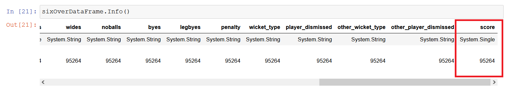

We could see a new column (score) has been added now.

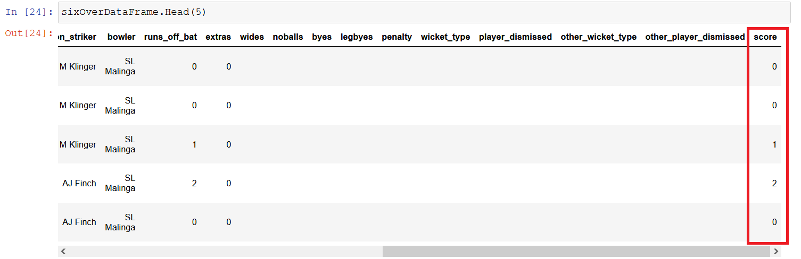

Now, we will add Total Score which represents the total number of runs scored till that ball.

```c#
/// <summary>
/// Adds a total score column to a DataFrame
/// </summary>
/// <param name="df">DataFrame to be updated</param>
public void AddTotalScorePerBall(Microsoft.Data.Analysis.DataFrame df)
{
    // calculate total_score per ball
    df.Columns.Add(new PrimitiveDataFrameColumn<Single>(CSV_COLUMN_TOTAL_SCORE, df.Rows.Count));
    Single previousMatchId = -1;
    Single previousInning = -1;
    Single previousScore = -1;

    foreach (var dfRow in df.Rows)
    {
        var matchId = (Single)dfRow[0];
        var inning = (Single)dfRow[4];
        var score = (Single)dfRow[df.Columns.Count - 2]; // Score

        if (previousMatchId == -1) // First time
        {
            // Reset
            previousMatchId = matchId;
            previousInning = inning;

            if (previousScore == -1)
            {
                previousScore = score;
            }
        }

        if (matchId == previousMatchId && inning == previousInning)
        {
            Single newScore = previousScore + score;

            // Total Score
            dfRow[df.Columns.Count - 1] = (Single)newScore;
            previousScore = newScore;
        }
        else
        {
            // Total Score
            dfRow[df.Columns.Count - 1] = (Single)score;
            
            // Reset
            previousMatchId = -1;
            previousInning = -1;
            previousScore = score;
        }
    }    
}
```

```c#
// Adds a total score column per pall
AddTotalScorePerBall(sixOverDataFrame);
```

```c#
// Display dataframe
display(sixOverDataFrame)
```

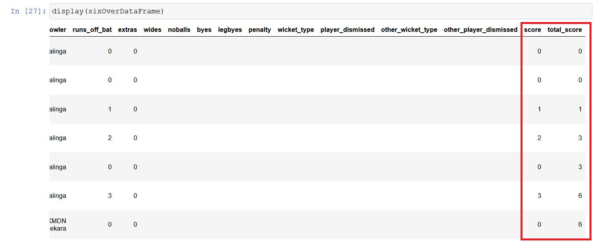

#### 4.e Feature Selection

There are 24 total columns in the dataset now. Not all of them are relevant for making prediction. There are different strategies available for Feature selection such as confusion matrix, seaborn plot which can be applied to select appropriate features. In order to keep things simple, I have chosen few parameters after performing different combinations. The features selected are as follows.

**Input Features**
- venue
- innings
- ball
- batting_team
- bowling_team
- striker
- non_striker
- bowler

**Output**
- total_runs

```c#
// Remove extra features
sixOverDataFrame.Columns.Remove("match_id");
sixOverDataFrame.Columns.Remove("season");
sixOverDataFrame.Columns.Remove("start_date");
sixOverDataFrame.Columns.Remove("runs_off_bat");
sixOverDataFrame.Columns.Remove("extras");
sixOverDataFrame.Columns.Remove("wides");
sixOverDataFrame.Columns.Remove("noballs");
sixOverDataFrame.Columns.Remove("byes");
sixOverDataFrame.Columns.Remove("legbyes");
sixOverDataFrame.Columns.Remove("penalty");
sixOverDataFrame.Columns.Remove("player_dismissed");
sixOverDataFrame.Columns.Remove("other_wicket_type");
sixOverDataFrame.Columns.Remove("other_player_dismissed");
sixOverDataFrame.Columns.Remove("score");
sixOverDataFrame.Columns.Remove("wicket_type");
```

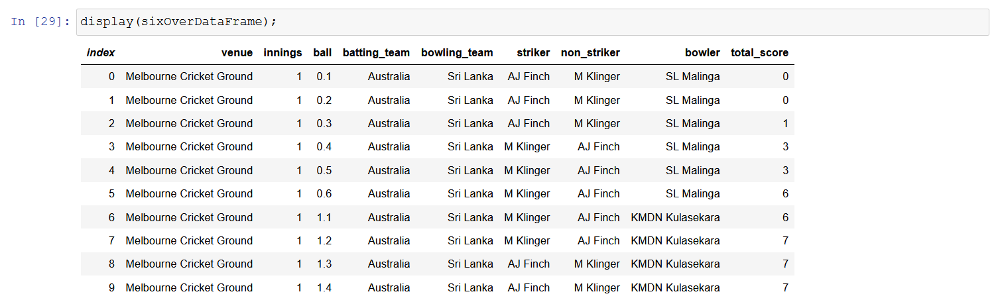

We could see, we have 9 columns only relevant to our problem.

```c#
// Information about the dataset
sixOverDataFrame.Info()
```

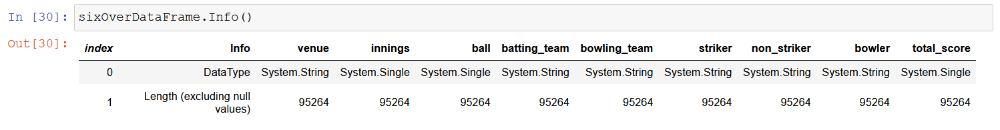

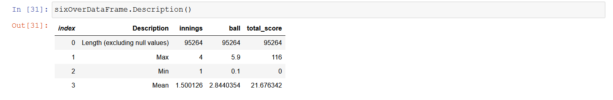

We are done with data analysis and have the dataset ready for model training and prediction which will be described in next section.

### Machine Learning - Training and Prediction

In this section, we'll be leveraging the dataset prepared and use it to for making prediction by using ML.Net framework. 

**Note** In order to make predictions, ML.Net requires a csv file that could be loaded by ML.Net API's. There is no direct way of loading a DataFrame to make predictions and DataFrame API doesn't expose any API to save the DataFrame to a csv file. 

I discovered a library 'Danny' which allows creating, manipulating and saving the DataFrame to a CSV file. 

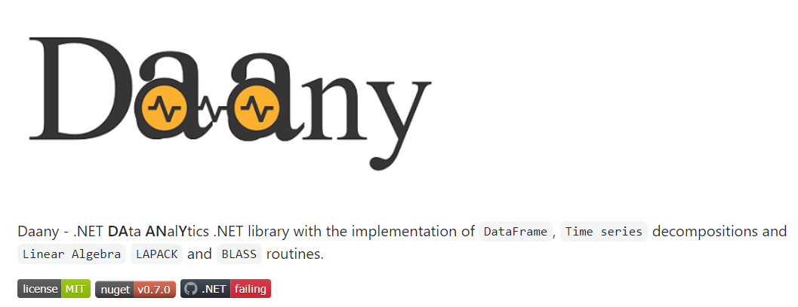


Link: https://github.com/bhrnjica/daany

I'll be using this library to recreate the DataFrame, perform modifications same as above and save it as a CSV file to be used for prediction. I found it to be very flexible. As this is kind of repetitive thing, feel free to skip to Training section for model creation and training.

#### Data Manipulation

We'll be performing below manipulation/transformation on the dataset

- Take records till 6 overs
- Remove missing values
- Add 'score' column representing runs per ball
- Add 'total_score' column to get the total score till the current ball

**Note** 
The csv dataset file has some values which contains comma ',' in the cell value such as venue having "Simonds Stadium, South Geelong". As a result of which, ML.Net LoadFromTextFile(...) API loads in a wrong manner and consider them to be two separate value instead of single. In order to overcome this, I have written a helper function CreateCsvAndReplaceSeparatorInCells(...) to replace comma with the specified character. 

```c#
/// <summary>
/// Replace a character in a cell of csv with a defined separator
/// </summary>
/// <param name="inputFile">Name of input file</param>
/// <param name="outputFile">Name of output file</param>
/// <param name="separator">Separator such as comma</param>
/// <param name="separatorReplacement">Replacement character such as underscore</param>
private static void CreateCsvAndReplaceSeparatorInCells(string inputFile, string outputFile, char separator, char separatorReplacement)
{
    var culture = CultureInfo.InvariantCulture;
    using var reader = new StreamReader(inputFile);
    using var csvIn = new CsvReader(reader, new CsvConfiguration(culture));
    using var recordsIn = new CsvDataReader(csvIn);
    using var writer = new StreamWriter(outputFile);
    using var outCsv = new CsvWriter(writer, culture);

    // Write Header
    csvIn.ReadHeader();
    var headers = csvIn.HeaderRecord;
    foreach (var header in headers)
    {
        outCsv.WriteField(header.Replace(separator, separatorReplacement));
    }
    outCsv.NextRecord();

    // Write rows
    while (recordsIn.Read())
    {
        var columns = recordsIn.FieldCount;
        for (var index = 0; index < columns; index++)
        {
            var cellValue = recordsIn.GetString(index);
            outCsv.WriteField(cellValue.Replace(separator, separatorReplacement));
        }
        outCsv.NextRecord();
    }
}
```

```c#
// Replace separator in cells
CreateCsvAndReplaceSeparatorInCells(DATASET_MERGED_CSV,  DATASET_ALL_CSV, ',', '_');
```

```c#
// Load CSV
Daany.DataFrame cricketDaanyDataFrame = Daany.DataFrame.FromCsv(DATASET_ALL_CSV);
display(cricketDaanyDataFrame.RowCount());    
```

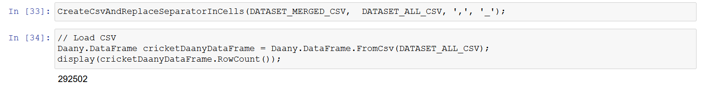

Remove Missing values

```c#
// Remove missing values
var missingValues = cricketDaanyDataFrame.MissingValues();

List<string> nonNullColumns = new List<string>();
foreach (var dfColumn in cricketDaanyDataFrame.Columns)
{
    if (!missingValues.ContainsKey(dfColumn))
    {
        display(dfColumn);
        nonNullColumns.Add(dfColumn);
    }
}

cricketDaanyDataFrame = cricketDaanyDataFrame[nonNullColumns.ToArray()];
display(cricketDaanyDataFrame);
```

Filter dataset to include till 6 overs and discard beyond that

```c#
// Filter dataset to include till 6 overs and discard beyond that
var sixBallDaanyDataFrame = cricketDaanyDataFrame.Filter(CSV_COLUMN_BALL, OVER_THRESHOLD, FilterOperator.LessOrEqual);
```

Add 'score' column

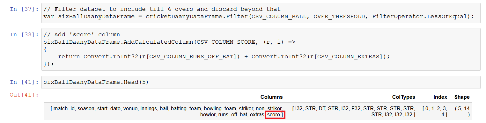

Calculating Total Score

There is no direct way to calculate the total score as it has to be cumulative sum and restricted to 6 overs only in the dataset. I have written a function to calculate the Total Score

```c#
/// <summary>
/// Adds a total_score column to the DataFrame by calculating the cumulative sum
/// </summary>
/// <param name="df">DataFrame to which new column is added</param>
public void AddTotalScorePerBallDaany(Daany.DataFrame df)
{
    // https://github.com/bhrnjica/daany
    // calculate total_score per ball
    df.AddCalculatedColumn(CSV_COLUMN_TOTAL_SCORE, (r, i) =>
    {
        var response = Convert.ToSingle(r[CSV_COLUMN_SCORE]);
        return 0;
    });

    int previousMatchId = -1;
    int previousInning = -1;
    float previousScore = -1;
    int rowIndex = 0;

    foreach (var dfRow in df.GetRowEnumerator())
    {
        var matchId = (int)dfRow[0];
        var inning = (int)dfRow[4];
        var score = Convert.ToSingle(dfRow[df.Columns.Count - 2]); // Score

        if (previousMatchId == -1) // First time
        {
            // Reset
            previousMatchId = matchId;
            previousInning = inning;

            if (previousScore == -1)
            {
                previousScore = score;
            }
        }

        if (matchId == previousMatchId && inning == previousInning)
        {
            float newScore = previousScore + score;

            // Total Score
            dfRow[df.Columns.Count - 1] = newScore;

            df[rowIndex, df.Columns.Count - 1] = newScore;
            previousScore = newScore;
        }
        else
        {
            // Total Score
            dfRow[df.Columns.Count - 1] = score;
            df[rowIndex, df.Columns.Count - 1] = score;

            // Reset
            previousMatchId = -1;
            previousInning = -1;
            previousScore = score;
        }

        rowIndex++;
    }
}
```

```c#
// Add Total score per ball to Daany Dataframe
AddTotalScorePerBallDaany(sixBallDaanyDataFrame);
display(sixBallDaanyDataFrame);
```

```c#
// Filter columns
sixBallDaanyDataFrame = sixBallDaanyDataFrame[CSV_COLUMN_VENUE, CSV_COLUMN_INNINGS, CSV_COLUMN_BALL, CSV_COLUMN_BATTING_TEAM, CSV_COLUMN_BOWLING_TEAM, CSV_COLUMN_STRIKER, CSV_COLUMN_NON_STRIKER, CSV_COLUMN_BOWLER, CSV_COLUMN_TOTAL_SCORE];
display(sixBallDaanyDataFrame);
```

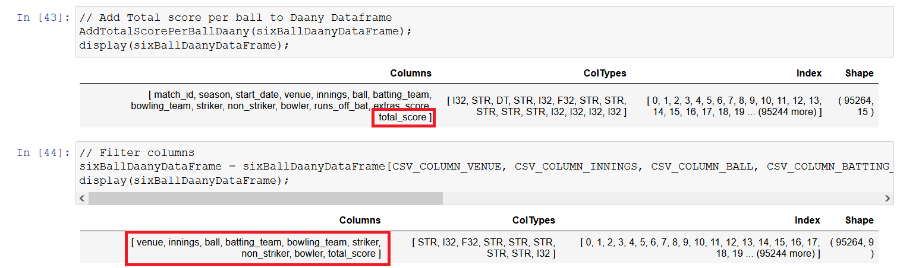

Final Dataset Columns

- Venue
- Innings
- Ball
- Batting_Team
- Bowling_Team
- Striker
- Non_Striker
- Bowler
- Total_Score

Save DataFrame to CSV

```c#
// Save DataFrame to CSV
Daany.DataFrame.ToCsv(DATASET_CLEANED_CSV, sixBallDaanyDataFrame);
```

#### Training

##### Data Classes

We need to create few data structures to map the columns within our dataset.

###### Match

Match contains input features involved in prediction, its the list of filtered columns.

```c#
/// <summary>
/// Represents the input features involved in prediction
/// </summary>
public class Match
{
    /// <summary>
    /// Match venue
    /// </summary>
    [LoadColumn(0)]
    public string Venue { get; set; }

    /// <summary>
    /// Innning within a Match
    /// </summary>
    [LoadColumn(1)]
    public float Inning { get; set; }

    /// <summary>
    /// Current Ball being thrown
    /// </summary>
    [LoadColumn(2)]
    public float Ball { get; set; }

    /// <summary>
    /// Name of the batting team
    /// </summary>
    [LoadColumn(3)]
    public string BattingTeam { get; set; }

    /// <summary>
    /// Name of the bowling team
    /// </summary>
    [LoadColumn(4)] 
    public string BowlingTeam { get; set; }

    /// <summary>
    /// Batsman on strike
    /// </summary>
    [LoadColumn(5)]
    public string Striker { get; set; }

    /// <summary>
    /// Non striker batsman
    /// </summary>
    [LoadColumn(6)]
    public string NonStriker { get; set; }

    /// <summary>
    /// Current bowler
    /// </summary>
    [LoadColumn(7)]
    public string Bowler { get; set; }

    /// <summary>
    /// Total score till the current ball
    /// </summary>
    [LoadColumn(8)]
    public float TotalScore { get; set; }
    
    public override string ToString()
    {
        var sb = new StringBuilder();
        sb.Append($"Venue: {Venue}");
        sb.Append($"\nBatting Team: {BattingTeam}");
        sb.Append($"\nBowling Team: {BowlingTeam}");
        sb.Append($"\nInning: {Inning}");
        sb.Append($"\nBall: {Ball}");
        sb.Append($"\nStriker: {Striker}");
        sb.Append($"\nNon-Striker: {NonStriker}");
        sb.Append($"\nBowler: {Bowler}");

        return sb.ToString();
    }
}
```

###### MatchScorePrediction

```c#
/// <summary>
/// Manages the score prediction 
/// </summary>
public class MatchScorePrediction
{
    /// <summary>
    /// Total runs scored by the team at the specified ball
    /// </summary>
    [ColumnName("Score")]
    public float TotalScore { get; set; }
}
```

##### Load Dataset

Now, we'll load the dataset into MLContext of ML.Net framework for making prediction.

```c#
// Load the dataset
var mlContext = new MLContext(seed:1);
IDataView data = mlContext.Data.LoadFromTextFile<Match>(
    path:DATASET_CLEANED_CSV,
    hasHeader: true,
    separatorChar: ',');
```

Split Dataset

Its always advised to split the dataset into train and test for better outcome. 

```c#
// Split dataset
var trainTestData = mlContext.Data.TrainTestSplit(data, 0.2); // Training/Test : 80/20
```

Transform Dataset

Now, we'll create Machine learning pipeline to train our model. OneHotEncoding is used for non-numerical input variables. It converts them into numeric format which an ML algorithm understands.

```c#
// Transform
var dataProcessPipeline = mlContext.Transforms.CopyColumns(outputColumnName: "Label", inputColumnName: nameof(Match.TotalScore))

    .Append(mlContext.Transforms.Categorical.OneHotEncoding("VenueEncoded", nameof(Match.Venue)))
    .Append(mlContext.Transforms.Categorical.OneHotEncoding("BattingTeamEncoded", nameof(Match.BattingTeam)))
    .Append(mlContext.Transforms.Categorical.OneHotEncoding("BowlingTeamEncoded", nameof(Match.BowlingTeam)))
    .Append(mlContext.Transforms.Categorical.OneHotEncoding("StrikerEncoded", nameof(Match.Striker)))
    .Append(mlContext.Transforms.Categorical.OneHotEncoding("NonStrikerEncoded", nameof(Match.NonStriker)))
    .Append(mlContext.Transforms.Categorical.OneHotEncoding("BowlerEncoded", nameof(Match.Bowler)))

    .Append(mlContext.Transforms.Concatenate("Features", 
        "VenueEncoded",
                        nameof(Match.Inning),
                        nameof(Match.Ball),
                        "BattingTeamEncoded",
                        "BowlingTeamEncoded",
                        "StrikerEncoded",
                        "NonStrikerEncoded",
                        "BowlerEncoded"
    ));
```

##### Train

Fit() method allows training of model on a given dataset. Here we have used FastTree regression algorithm.

```c#
// Train
var trainingPipeline = dataProcessPipeline.Append(mlContext.Regression.Trainers.FastTree(labelColumnName: "Label", featureColumnName: "Features"));
var trainedModel = trainingPipeline.Fit(trainTestData.TrainSet);
```

#### Evaluate

We'll evaluate the model on test dataset

```c#
var predictions = trainedModel.Transform(trainTestData.TestSet);
var metrics = mlContext.Regression.Evaluate(predictions, "Label", "Score");
display($"*************************************************");
display($"*       Model quality metrics evaluation         ");
display($"*------------------------------------------------");
display($"*       RSquared Score:      {metrics.RSquared:0.##}");
display($"*       Root Mean Squared Error:      {metrics.RootMeanSquaredError:#.##}");
```

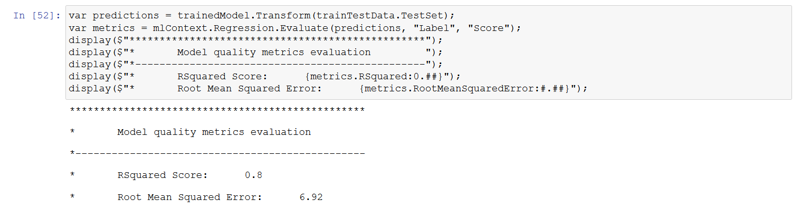

#### Save Model

```c#
// Save
var savedPath = Path.Combine(Directory.GetCurrentDirectory(), MODEL_FILE);
mlContext.Model.Save(trainedModel, trainTestData.TrainSet.Schema, savedPath);
display($"The model is saved to {savedPath}");
```

#### Prediction

Lastly, we'll make prediction on unseen data using PredictionEngine from ML.Net and see how much variance is there between actual and predicted score.

```c#
// Predict
display("*********** Predict...");
var predictionEngine = mlContext.Model.CreatePredictionEngine<Match, MatchScorePrediction>(trainedModel);
var match = new Match
{
    Ball = 3.4f,
    BattingTeam = "India",
    BowlingTeam = "New Zealand",
    Bowler = "CJ Anderson",
    Inning = 1,
    Striker = "V Kohli",
    NonStriker = "Yuvraj Singh",
    Venue = "Vidarbha Cricket Association Stadium_ Jamtha"
};

// make the prediction
var prediction = predictionEngine.Predict(match);

// report the results
display($"Match Info:\n\n{match} ");
display($"\n^^^^^^ Prediction:  {prediction.TotalScore} ");
display($"**********************************************************************");
display($"Predicted score: {prediction.TotalScore:0.####}, actual score: 20");
display($"**********************************************************************");
```

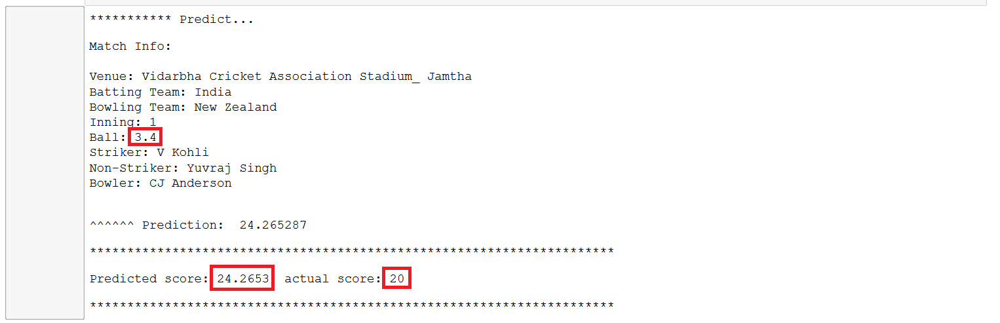

The model has performed quite well as the predicted score is quite near to the actual score. We need to see how it perform with different set of data. We have used FastTree algorithm which seems to be good. There are lot of things we can try to improve here by choosing different algorithm, features, and large dataset etc.

## Conclusion

Cricket is an interesting game with some nerve wracking moments during the match which keeps you on the toes. With this excitement and enthusiasm, a lot of data gets generated per ball that gets delivered over the field. This humungoes data is intelligently utilized by Data scients, Machine learning and AI practitioner to make insights and predictions about various aspects of the game. In this notebook, I have just scratched the possibilities that could be explored in the game of cricket. We took the dataset from web, cleaned, analyzed and finally able to make a prediction of finding a score. We have explored the usage some great libraries such as DataFrame, ML.Net and Daany.

I hope you have enjoyed the notebook.

## Resources

- Notebook: https://github.com/praveenraghuvanshi/tech-sessions/blob/master/08022022-Developer-Week-2022/CricketAnalysis.ipynb
- Source: https://github.com/praveenraghuvanshi/tech-sessions/tree/master/08022022-Developer-Week-2022/src/SportAnalytics

## Contact

Linktree: https://linktr.ee/praveenraghuvanshi
Twitter: @praveenraghuvan\
Github: praveenraghuvanshi\
Blog: praveenraghuvanshi.github.io\
Dev.To: https://dev.to/praveenraghuvanshi\
Website: https://www.praveenraghuvanshi.com\
Email: [contact@praveenraghuvanshi.com](mailto:contact@praveenraghuvanshi.com)

